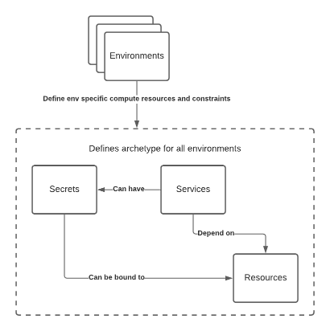

# Core Concepts

There are usually three pain-points to managing infrastructure and deployments in a micro-services architecture:

* Managing secrets.
* Managing environment specific settings in a decoupled manner.
* Ancillary infrastructure setup, such as permissions/privileges & networking.

xlrte solves this by making the concept of `service`s central, and simply letting services define the things they need, such as databases (an example of a `resource`) and secrets. The xlrte runtime will figure out all the supporting infrastructure & permissions required to connect the services to their dependencies.

### Identity & Access Management (IAM)
With xlrte, each service will have its own service account (or equivalent) created, with exactly the minimum privileges set required to exercise the functionality and use the dependencies defined in the service configuration.
### Secrets management
Secrets management is built into xlrte, using PGP encryption. This means the xlrte binary allows you to securely add secrets to a project, such that they are encrypted at rest, and can be committed into a git repository. Furthermore secrets are automatically set into the equivalent cloud providers secrets service (for GCP, `Secret Manager`) and automatically injected into your services. Run `xlrte secret help` for more information.

Resources that require secrets (such as a Postgres database) will have secrets (password etc) automatically generated and injected into the service(s) that depend on them.